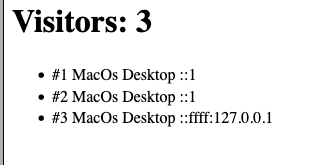

# Test Report

## Summary

The module is tested in two ways.

**Automated unit tests (Vitest).** Every class has its own test file next to the
source file: `src/Visitor.test.ts`, `src/VisitorTracker.test.ts` and
`src/UserAgentParser.test.ts`. The tests use hard-coded user agent strings copied
from real browsers, so the same input always gives the same expected output. The
parser tests cover the cases that are easy to get wrong: an iPad also reports
`Mobile`, and an Android phone also reports `Linux`, so the order of the checks
matters.

Run them with:

```bash
npm install
npm run test:run
```

**Manual testing through the test app.** `test-app/app.ts` is a small Node server
that calls `track()` for every request and lists the tracked visitors. It shows
that the module works with real browsers and real requests, which the unit tests
cannot show.

Run it with:

```bash
npm start
```

then open <http://localhost:3001> in one browser, reload the page a few times,
and open the same address in a second and a third browser.

All 12 automated tests pass, and the manual tests behaved as expected.

## Test Results



| What was tested | How it was tested | Result |
| --- | --- | --- |
| `Visitor` stores the values it is created with. | Automated unit test (Vitest): created a `Visitor` with known data and read the properties back. | ✅ Passed. |
| `Visitor.ipAddress` is optional. | Automated unit test: created a `Visitor` without an IP address and checked that `ipAddress` is `undefined`, then created one with an IP address and checked that it is kept. | ✅ Passed. |
| `UserAgentParser.parseDeviceType()` for desktop, mobile, tablet, TV and unknown. | Automated unit test: six user agent strings (Windows, iPhone, iPad, Android, SmartTV and an unrecognised string) parsed and compared to the expected device type. | ✅ Passed. An iPad is reported as `Tablet` even though its user agent also contains `Mobile`. |
| `UserAgentParser.parseOperatingSystem()` for Windows, macOS, iOS, Android and Linux. | Automated unit test: six user agent strings parsed and compared to the expected operating system. | ✅ Passed. An Android phone is reported as `Android` even though its user agent also contains `Linux`. |
| Unrecognised user agent strings. | Automated unit test: the string `'Unknown User Agent'` passed to both parser methods. | ✅ Passed. Both return `Unknown` instead of failing. |
| A new `VisitorTracker` starts empty. | Automated unit test: checked `getVisitors()` and the id counter on a newly created tracker. | ✅ Passed. |
| `track()` creates and stores a new visitor. | Automated unit test: tracked one request and checked that a `Visitor` was returned and that the tracker holds one visitor. | ✅ Passed. |
| `track()` recognises a returning visitor. | Automated unit test: tracked the same IP address and user agent twice and compared the two returned visitors. | ✅ Passed. The same visitor is returned and the count stays at 1. |
| `track()` separates two different visitors. | Automated unit test: tracked two requests with different IP addresses and compared their ids. | ✅ Passed. Two visitors with different ids. |
| `track()` fills in device type and operating system. | Automated unit test: tracked a request with a Windows Chrome user agent and read the properties of the returned visitor. | ✅ Passed. `Desktop` and `Windows`. |
| `getVisitorCount()` returns the number of unique visitors. | Automated unit test: tracked two different visitors and checked the count. | ✅ Passed. |
| The module works with real browser requests. | Manual test: started the test app with `npm start` and opened <http://localhost:3001> in three different browsers. | ✅ Passed. Three visitors were tracked, each with the correct operating system and device type (see the screenshot above). |
| A returning visitor does not increase the count. | Manual test: reloaded the page several times in the same browser and watched the visitor count. | ✅ Passed. The count stayed unchanged. |
| The IP address is read from the request. | Manual test: read the IP address shown for each visitor in the test app. | ⚠️ Works, but Node reports localhost both as `::1` and as `::ffff:127.0.0.1`, so the same machine can end up as two visitors. Known limitation. |

## Known issues

- IP addresses are not normalised, so `::1` and `::ffff:127.0.0.1` are treated as
  two different visitors even though they are the same machine.
- Visitors are identified by IP address and user agent only. The same person using
  two browsers counts as two visitors, and two people behind the same network using
  the same browser count as one. This is a deliberate trade-off, since the module
  uses no cookies.
